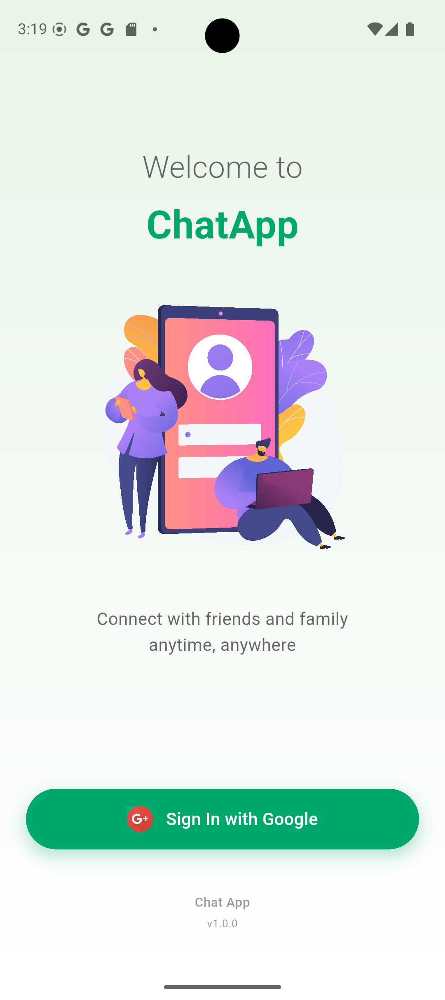
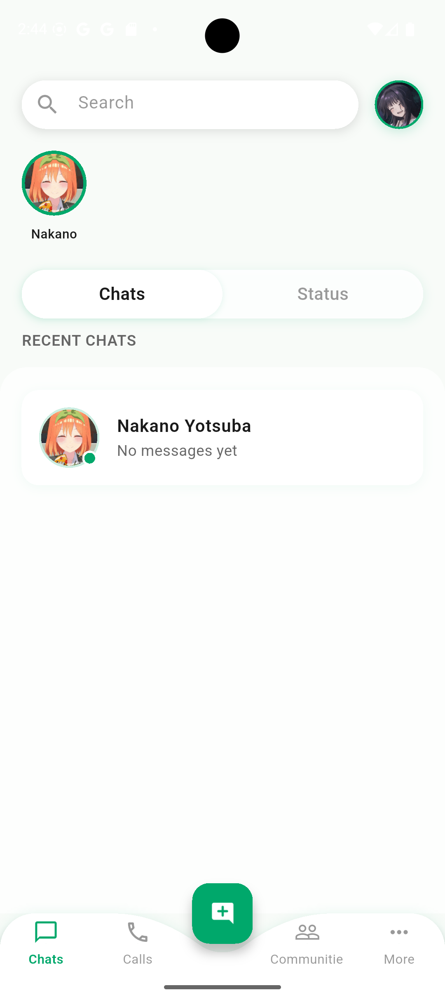
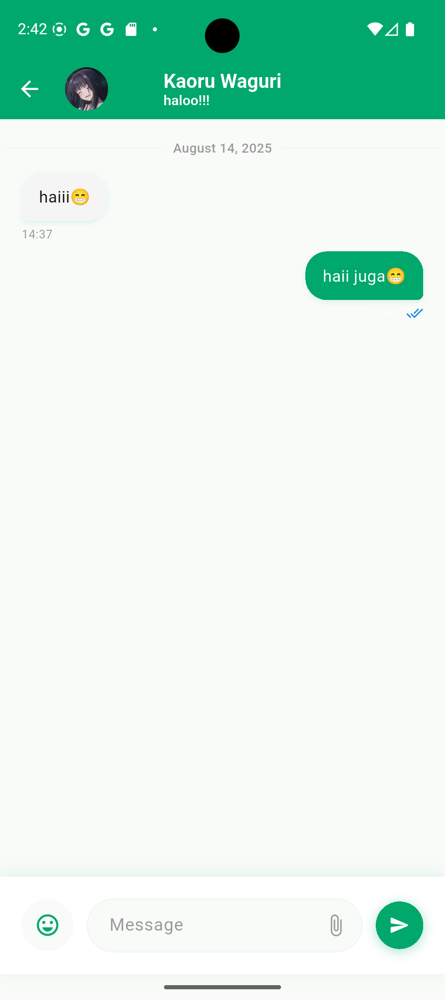
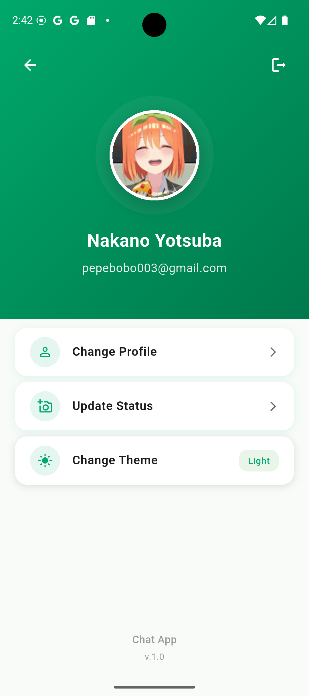

# Chateo - Real-time Chat Application

<div align="center">
  
  
  [](https://flutter.dev)
  [](https://firebase.google.com)
  [](https://dart.dev)

**A modern, real-time chat application built with Flutter and Firebase**

</div>

## 📱 About The Application

Chateo adalah aplikasi chat real-time yang memungkinkan pengguna untuk berkomunikasi secara instant dengan fitur-fitur modern. Aplikasi ini dibangun menggunakan Flutter untuk cross-platform development dan Firebase sebagai backend untuk real-time messaging dan autentikasi.

## ✨ Key Features

### 🔐 Authentication & Security

- **Google Sign-In Integration** - Login mudah menggunakan akun Google
- **Auto-login** - Tetap login otomatis untuk pengalaman pengguna yang seamless
- **Secure Authentication** - Menggunakan Firebase Authentication untuk keamanan tingkat enterprise

### 💬 Chat Features

- **Real-time Messaging** - Pesan terkirim dan diterima secara instant
- **Read Status** - Indikator pesan sudah dibaca atau belum
- **Emoji Support** - Dukungan emoji picker untuk ekspresi yang lebih kaya
- **Message Grouping** - Pesan dikelompokkan berdasarkan tanggal untuk kemudahan membaca
- **Unread Message Counter** - Penghitung pesan yang belum dibaca
- **Chat History** - Riwayat percakapan tersimpan secara permanen

### 👤 Profile Management

- **Profile Customization** - Edit nama, status, dan foto profil
- **Status Updates** - Update status personal yang dapat dilihat teman
- **Profile Photo** - Upload dan ganti foto profil
- **User Search** - Cari dan tambahkan teman baru untuk chat

### 🎨 User Interface

- **Modern Design** - Interface yang clean dan user-friendly
- **Smooth Animations** - Animasi Lottie untuk pengalaman visual yang menarik
- **Responsive Layout** - Tampilan yang responsif di berbagai ukuran layar
- **Dark/Light Theme Support** - Dukungan tema gelap dan terang
- **Bottom Navigation** - Navigasi mudah dengan bottom navigation bar

### 🚀 Performance Features

- **Optimized Loading** - Loading yang cepat dengan caching
- **Efficient Data Usage** - Penggunaan data yang efisien untuk chat real-time
- **Background Sync** - Sinkronisasi data di background
- **Auto-scroll** - Auto-scroll ke pesan terbaru

## 🛠 Tech Stack

### **Frontend Framework**

- **Flutter 3.0+** - Cross-platform mobile development framework
- **Dart** - Programming language untuk Flutter

### **State Management**

- **GetX** - State management, dependency injection, dan route management

### **Backend & Database**

- **Firebase Firestore** - NoSQL cloud database untuk real-time data
- **Firebase Authentication** - Service autentikasi yang aman dan scalable
- **Firebase Core** - Core Firebase SDK untuk konfigurasi

### **UI/UX Libraries**

- **Lottie** - Animasi vector yang smooth dan ringan
- **Introduction Screen** - Onboarding screen yang menarik
- **Avatar Glow** - Efek glow pada avatar pengguna
- **Emoji Picker Flutter** - Widget picker emoji yang lengkap
- **Animated Bottom Navigation Bar** - Bottom navigation dengan animasi

### **Utilities & Tools**

- **Google Sign-In** - Integrasi login dengan Google
- **Get Storage** - Local storage yang mudah digunakan
- **Path Provider** - Akses direktori sistem untuk file management
- **Image Picker** - Pilih gambar dari galeri atau kamera
- **Permission Handler** - Manajemen permission aplikasi
- **Intl** - Internationalization dan formatting date/time

### **Development Tools**

- **Flutter Lints** - Linting rules untuk kode yang clean
- **Flutter Launcher Icons** - Generator icon aplikasi otomatis

## 📁 Project Structure

```
lib/
├── app/
│   ├── controllers/           # Global controllers (Auth, Theme)
│   ├── data/
│   │   ├── models/           # Data models (User, Chat)
│   │   └── themes/           # App theme configurations
│   ├── modules/              # Feature modules
│   │   ├── chat_room/        # Chat room functionality
│   │   ├── home/             # Home screen
│   │   ├── login/            # Authentication
│   │   ├── profile/          # User profile
│   │   ├── new_chat/         # Start new chat
│   │   └── ...
│   ├── routes/               # App routing configuration
│   └── utils/                # Utility functions
├── utils/                    # Global utilities
├── firebase_options.dart     # Firebase configuration
└── main.dart                # App entry point
```

## 🔥 Firebase Configuration

### **Firestore Database Structure**

```javascript
// Users Collection
users/{email} {
  uid: string,
  email: string,
  name: string,
  photoUrl: string,
  status: string,
  keyName: string,
  chats: [
    {
      connection: string,      // Email teman chat
      chat_id: string,         // ID dokumen chat
      lastTime: timestamp,     // Waktu pesan terakhir
      total_unread: number     // Jumlah pesan belum dibaca
    }
  ],
  creationTime: timestamp,
  lastSignInTime: timestamp,
  updatedTime: timestamp
}

// Chats Collection
chats/{chatId} {
  connections: [email1, email2],  // Array email participants
  chat: [
    {
      pengirim: string,           // Email pengirim
      penerima: string,           // Email penerima
      pesan: string,              // Isi pesan
      time: timestamp,            // Waktu kirim
      isRead: boolean,            // Status baca
      groupTime: string           // Tanggal untuk grouping
    }
  ],
  lastMessage: string,            // Pesan terakhir
  last_Time: timestamp,           // Waktu pesan terakhir
  total_unread: number            // Total pesan belum dibaca
}
```

## 🚀 Getting Started

### **Prerequisites**

- Flutter SDK (3.0.0 atau lebih baru)
- Dart SDK (2.17.0 atau lebih baru)
- Android Studio / VS Code
- Firebase project dengan Firestore dan Authentication enabled

### **Installation**

1. **Clone repository**

```bash
git clone https://github.com/yourusername/chateo.git
cd chateo
```

2. **Install dependencies**

```bash
flutter pub get
```

3. **Firebase Setup**

   - Buat project baru di [Firebase Console](https://console.firebase.google.com)
   - Enable Authentication (Google Sign-In)
   - Enable Cloud Firestore
   - Download `google-services.json` dan letakkan di `android/app/`
   - Update `firebase_options.dart` dengan konfigurasi project Anda

4. **Run the application**

```bash
flutter run
```

### **Building for Production**

```bash
# Build APK
flutter build apk --release

# Build App Bundle (recommended for Play Store)
flutter build appbundle --release

# Build iOS (requires macOS)
flutter build ios --release
```

## 📱 Screenshots

| Login Screen                           | Chat List                                      | Chat Room                                      | Profile                                    |
| -------------------------------------- | ---------------------------------------------- | ---------------------------------------------- | ------------------------------------------ |
|  |  |  |  |

## 🎯 Key Features Implementation

### **Real-time Messaging**

- Menggunakan Firestore Streams untuk real-time updates
- Optimized query untuk performa yang baik
- Message grouping berdasarkan tanggal

### **Authentication Flow**

- Google Sign-In integration
- Auto-login dengan token validation
- Secure user session management

### **State Management**

- GetX untuk reactive state management
- Dependency injection untuk controller
- Efficient memory management

### **UI/UX Design**

- Material Design principles
- Smooth animations dengan Lottie
- Responsive design untuk berbagai screen size

## 🔧 Configuration

### **Firebase Rules**

```javascript
// Firestore Security Rules
rules_version = '2';
service cloud.firestore {
  match /databases/{database}/documents {
    // Users dapat read/write data mereka sendiri
    match /users/{email} {
      allow read, write: if request.auth != null && request.auth.token.email == email;
    }

    // Chat documents dapat diakses oleh participants
    match /chats/{chatId} {
      allow read, write: if request.auth != null &&
        request.auth.token.email in resource.data.connections;
    }
  }
}
```

## 🤝 Contributing

Kami menyambut kontribusi dari developer lain! Silakan:

1. Fork repository ini
2. Buat branch untuk fitur baru (`git checkout -b feature/AmazingFeature`)
3. Commit perubahan (`git commit -m 'Add some AmazingFeature'`)
4. Push ke branch (`git push origin feature/AmazingFeature`)
5. Buat Pull Request

## 📄 License

Project ini menggunakan MIT License. Lihat file `LICENSE` untuk detail lengkap.

## 👥 Team

- **Developer**: [Your Name]
- **UI/UX Designer**: [Designer Name]
- **Project Manager**: [PM Name]

## 📞 Support

Jika Anda menemukan bug atau memiliki pertanyaan:

- 📧 Email: support@chateo.com
- 🐛 Issues: [GitHub Issues](https://github.com/yourusername/chateo/issues)
- 📱 WhatsApp: +62 xxx-xxxx-xxxx

## 🗺 Roadmap

### **Version 2.0 (Coming Soon)**

- [ ] Voice messages
- [ ] File sharing
- [ ] Group chat
- [ ] Video calling
- [ ] Push notifications
- [ ] Message encryption
- [ ] Chat backup & restore
- [ ] Multi-language support

### **Version 1.5**

- [ ] Message reactions
- [ ] Reply to messages
- [ ] Message forwarding
- [ ] Online status indicator
- [ ] Typing indicator

---

<div align="center">
  <p>Made with ❤️ using Flutter & Firebase</p>
  <p>© 2025 Chateo. All rights reserved.</p>
</div>
